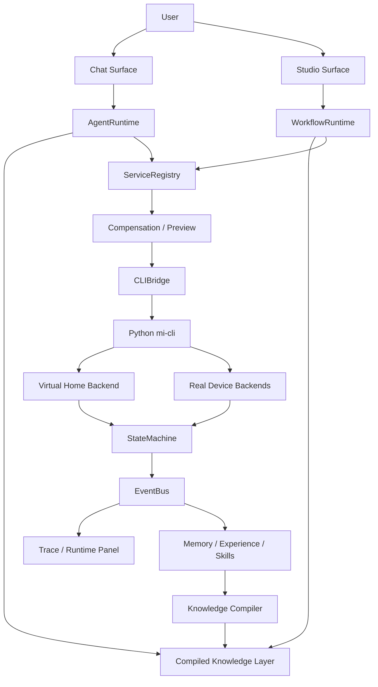

# HomeSense Studio Plus 终极架构闭环

> 文档定位：这不是一个面向商业交付的完整智能家居产品规格，而是一个用于求职展示的个人项目架构母版。
> 它的目标是在保留长期扩展能力的前提下，用一个高度聚焦的家庭演示场景，展示完整的 Agent 工程、设备抽象、Workflow 编排、知识编译、可观测性和测试闭环能力。

## 1. 项目一句话

HomeSense Studio Plus 是一个家庭场景 Agent 操作系统：它用 Chat 理解人的意图，用 Studio 作为 Agent 中枢与可视化控制平面来编排流程、调度外部执行器，用统一设备能力层执行动作，用 Trace 呈现全过程，并把成功/失败经验编译成下一次可复用的家庭知识、技能、规则和 Workflow。

## 2. 核心定位

HomeSense 老项目已经证明过“Agent 闭环”是可行的。旧闭环大致是：

```text
用户输入
-> 意图路由
-> 上下文补全
-> 规则引擎
-> 意图归一化
-> 成功经验检索
-> LLM Agent
-> 工具执行
-> 经验写回
```

Plus 版不是从零重新证明“能不能控制设备”，而是把旧项目升级成一个更适合展示工程能力的新架构：

- 从脚本式闭环升级为双入口平台：Chat Surface + Studio Surface。
- 从混合代码升级为清晰模块边界：AgentRuntime、WorkflowRuntime、CLIBridge、Memory、Skills、Experience、Compensation、SelfEnhancement。
- 从普通 RAG 升级为编译知识层：把文档、设备能力、Trace、经验和用户修正编译成可执行候选计划。
- 从真实设备优先升级为虚拟设备优先：先构造可测试家庭，再接入真实家庭。
- 从单次演示升级为可回放、可观测、可沉淀的系统闭环。

## 3. 求职项目目标

这个项目服务于求职展示，而不是追求完整商业化落地。因此架构策略是：

1. 架构上保留未来能力。
2. 实现上聚焦目标演示场景。
3. 文档上展示系统设计深度。
4. Demo 上展示端到端闭环。
5. 代码上展示工程边界、测试意识和可维护性。

面试官应该能从项目中看到这些能力：

- 全栈工程能力：Vue Studio、Fastify 后端、Python CLI、SQLite 存储。
- Agent 工程能力：L1/L2/L3 分层、工具调用、上下文管理、失败反思。
- RAG/知识工程能力：向量检索、FTS、重排序、知识编译、经验沉淀。
- Workflow 能力：节点运行、变量池、Trace、手动/Chat/定时触发。
- 设备抽象能力：统一 capability/service 层屏蔽米家、红外、小爱、蓝牙、电脑脚本。
- 可观测性能力：SSE/WebSocket Trace、运行回放、调试面板。
- 测试基础设施能力：虚拟设备、失败注入、状态机、端到端场景测试。

## 4. 非目标

为了避免项目发散，Plus 版第一阶段明确不追求：

- 不追求覆盖所有智能家居品类。
- 不追求替代 Home Assistant。
- 不追求做商业 SaaS。
- 不追求一次性接入所有模型供应商。
- 不追求真实家庭设备 100% 稳定。
- 不优先做灯、窗帘、空调这类泛智能家居样板场景。

第一阶段只服务于一个强演示切片：家庭影音与电脑控制。

## 5. 目标演示场景

当前演示家庭只关注这些设备：

- 东芝电视
- 乐视电视
- 两个机顶盒
- 小爱音箱红外版（蓝牙 + 红外中枢）
- 红米小爱音箱
- 蓝牙开机卡
- 台式机
- 笔记本

核心演示指令：

```text
帮我打开东芝电视看机顶盒
把电视声音调大一点
切到乐视电视
打开台式机
让小爱红外中枢执行红外按键
把这套流程保存成一个工作流
下次我说“看电视”就自动走这个流程
```

这个切片足够展示系统能力，因为它包含：

- 多设备上下文
- 红外不可靠执行
- 设备状态观察
- Agent 规划
- Workflow 编排
- 失败重试
- 经验写回
- L1/L2/L3 升级路径

## 6. 总体架构



系统由七层组成：

1. Surface 层：Chat 与 Studio。
2. Runtime 层：AgentRuntime 与 WorkflowRuntime。
3. Knowledge 层：Memory、Experience、Skills、Compiled Wiki。
4. Governance 层：RuleEngine、Compensation、Permission、SelfEnhancement。
5. Capability 层：ServiceRegistry、EntityRegistry、StateMachine。
6. Integration 层：CLIBridge、mi-cli、模型接入商。
7. Device/Test 层：Virtual Home、Mijia、IR、小爱、蓝牙、电脑脚本。

## 7. 双入口：Chat 与 Studio

Chat Surface 面向自然语言：

- 用户说目标。
- Agent 判断意图与上下文。
- 系统展示步骤、计划、执行、状态变化和写回。
- 成功路径可以晋升为经验、技能、规则或 Workflow。

Studio Surface 面向可视化编排与 Agent 中枢控制：

- 用户拖拽节点。
- 节点可以是设备动作、条件、变量、LLM、子流程、等待、重试、CLI 执行器、外部 Agent 执行器。
- Workflow 可以手动执行、被 Chat 调用、被定时器触发。
- Workflow 执行过程同样进入 Trace 与经验系统。

Studio 的正确定位不是“家庭自动化画布”，而是一个 Workflow Control Plane：

- 它可以编排家庭设备动作。
- 它可以调度 `mi-cli`、ADB/无障碍执行器。
- 它可以调度内容生产或平台侧 CLI，例如 B 站 CLI。
- 它可以把其他 Agent 当作可调用执行器或子流程节点，例如 OpenClaw、Claude Code、Codex 或未来其他 Agent。
- 它是高级用户的操作台，而不是单个 Agent 的附属页面。

重要原则：Chat 和 Studio 不是两个系统。它们共享同一个设备模型、服务注册、状态机、知识层和 Trace。

## 8. L1/L2/L3 决策体系

Chat Runtime 使用三层决策：

### L1：确定性路径

适用于高置信、低风险、已知成功的问题。

来源包括：

- 规则
- 明确技能
- 已验证 Workflow
- 成熟成功路径
- 设备能力直达映射

例子：

```text
用户：打开台式机
L1：匹配到 desktop.power_on capability -> bluetooth_wake_card.press
```

### L2：编译知识层

L2 不再只是“向量检索几个 chunk”。它是运行时的编译知识层，负责从已整理的家庭 Wiki、经验、设备能力和历史 Trace 中生成候选计划。

L2 的输出不是原始文本，而是结构化候选：

```ts
type CandidatePlan = {
  goal: string
  confidence: number
  entities: string[]
  steps: ToolAction[]
  assumptions: string[]
  risks: string[]
  evidence: KnowledgeRef[]
}
```

例子：

```text
用户：看电视
L2：根据家庭 Wiki 判断默认电视=东芝电视，默认信号源=机顶盒1，
    输出候选计划：开电视 -> 开机顶盒 -> 切 HDMI1 -> 设置音量。
```

### L3：LLM 规划层

当 L1/L2 不能解决时，进入 L3：

- 复杂上下文理解
- 多设备规划
- 失败恢复
- 用户偏好推断
- 经验反思
- 新技能草稿生成

L3 成功后必须写回，不能成为一次性黑盒调用。

## 9. 编译知识层

编译知识层是 Plus 版的核心升级。

传统 RAG 像解释器：运行时搜资料，临时拼 prompt，让模型现场理解。

HomeSense Plus 的 L2 更像编译器：提前把家庭资料、设备能力、历史经验、失败记录和用户修正编译成可执行知识。

输入源：

- 设备发现结果
- MIoT / IR / 小爱能力描述
- 用户写的家庭说明
- Chat 成功 Trace
- Workflow 成功 Trace
- 失败 Trace
- 用户纠错
- 手写 Skills
- 手写 Rules

编译产物：

- `wiki_pages`：家庭 Wiki 页面，人和 Agent 都能读。
- `compiled_plans`：高置信可执行计划。
- `memory_triples`：设备、房间、关系、偏好。
- `experience_docs`：成功经验与故障经验。
- `skill_candidates`：可晋升技能。
- `rule_candidates`：可晋升规则。
- `workflow_candidates`：可视化流程候选。

运行时职责：

```text
用户目标
-> 召回相关 Wiki/Plan/Experience
-> 生成 CandidatePlan
-> 做实体校验和风险校验
-> 交给 AgentRuntime 或 WorkflowRuntime 执行
```

失效机制：

- 设备能力变化，相关计划失效。
- 执行失败次数过多，降低置信度。
- 用户明确纠正，更新 Wiki 和候选计划。
- 真实设备状态与虚拟模型不一致，触发重新编译。

## 10. 设备能力模型

系统不直接把“设备 API”暴露给 Agent，而是暴露统一 capability。

核心对象：

```ts
type Device = {
  id: string
  name: string
  domain: "tv" | "set_top_box" | "speaker" | "hub" | "ir_remote" | "computer" | "wake_adapter"
  room: string
  features: Feature[]
}

type Feature = {
  id: string
  deviceId: string
  capability: string
  services: ServiceAction[]
}

type EntityState = {
  entityId: string
  value: unknown
  observedAt: string
  source: "virtual" | "mijia" | "ir" | "bluetooth" | "script" | "user"
  confidence: number
}
```

第一阶段重点 capability：

- `power.on`
- `power.off`
- `input.select`
- `volume.up`
- `volume.down`
- `volume.set`
- `remote.press_key`
- `remote.macro`
- `speaker.say`
- `speaker.execute`
- `ir.remote`
- `ir.macro`
- `bluetooth.gateway`
- `computer.wake`
- `computer.sleep`
- `computer.status`

## 11. 虚拟家庭层

虚拟设备不是临时 mock，而是第一阶段核心基础设施。

它的价值：

- 不依赖真实设备在线。
- 可以稳定复现演示。
- 可以注入失败。
- 可以做端到端测试。
- 可以验证 Agent 计划是否真的改变状态。
- 可以在面试演示时保证成功率。

虚拟层必须走真实链路：

```text
Frontend
-> Backend API
-> AgentRuntime / WorkflowRuntime
-> ServiceRegistry
-> CLIBridge
-> mi-cli
-> virtual backend
-> StateMachine
-> EventBus
-> Trace UI
```

禁止只在前端假装成功。演示价值来自完整链路可观测。

虚拟设备需要支持：

- 当前状态
- 可执行动作
- 状态转移
- 延迟
- 失败注入
- 红外丢包
- 离线
- 幂等处理
- 事件记录

## 12. 执行前预览与补偿

所有有副作用动作都经过 Preview：

```text
计划生成
-> 参数校验
-> 实体存在性校验
-> 当前状态校验
-> 风险评估
-> 是否需要确认
-> 执行
-> 观察
-> 失败补偿
```

风险等级：

- `safe`：可直接执行，如查询状态。
- `normal`：普通控制，如调音量。
- `attention`：可能影响当前使用，如切换信号源。
- `dangerous`：关机、批量操作、不可逆动作，需要确认。

补偿策略：

- 重试
- 等待后重试
- 替代动作
- 回滚状态
- 请求用户确认
- 写入失败经验

## 13. Trace 与可观测性

Trace 是产品能力，也是求职展示能力。

每次运行必须能看到：

- 用户原始输入
- 意图识别结果
- L1/L2/L3 路由原因
- 召回的知识
- 生成的计划
- Preview 检查结果
- 每一步 ToolAction
- 设备状态变化
- 失败原因
- 重试过程
- 写回内容
- 最终晋升建议

Trace 既服务调试，也服务经验编译。

## 14. 数据与存储

SQLite 是运行时事实源：

- devices
- features
- entity_states
- events
- workflow_runs
- agent_runs
- tool_calls
- memories
- experiences
- skills
- compiled_plans
- wiki_pages

Markdown 是人类可读知识源：

- Wiki 页面
- Experience 文档
- Skill 文档
- 架构文档
- 演示脚本

索引层是加速器：

- FTS5：关键词检索。
- Vector：语义召回。
- Graph/Triple：关系召回。

原则：

```text
SQLite 管状态与事实。
Markdown 管可读知识。
Vector/FTS 管召回效率。
Compiler 管知识同步。
```

## 15. 模型接入

系统不绑定具体供应商，而是使用能力槽：

```ts
type ModelSlots = {
  planner_llm: ModelRef
  fast_llm: ModelRef
  embedding_model: ModelRef
  rerank_model?: ModelRef
  vision_model?: ModelRef
}
```

当前项目指定接入：

- `planner_llm`：`deepseek-v4-flash`，复杂规划、反思、经验总结。
- `fast_llm`：`deepseek-v4-flash`，第一阶段复用 planner。
- `embedding_model`：`qwen3-embedding-4b`，Wiki、经验、设备能力向量化。
- `rerank_model`：`qwen3-reranker-4b`，L2 召回重排序。
- `vision_model`：`qwen3.5-4b`，后续 ADB/无障碍/截图理解兜底。

这些模型统一走 Pie-Xian OpenAI-compatible endpoint。密钥只进入本地 `.env`，不进入文档或示例文件。

## 16. 模块边界

推荐模块：

- `EntityRegistry`：注册设备、Feature、Entity。
- `StateMachine`：维护状态与状态变化事件。
- `ServiceRegistry`：注册统一 capability。
- `RuleEngine`：L1 确定性规则。
- `AgentRuntime`：Chat 执行主循环。
- `WorkflowRuntime`：Studio Agent 中枢执行主循环。
- `CLIBridge`：TS 到 Python 的唯一桥。
- `AgentGateway`：外部 Agent / CLI / worker 的统一调度入口。
- `VirtualHome`：虚拟设备世界。
- `MemoryService`：短期/长期/关系记忆。
- `ExperienceService`：成功/失败经验。
- `SkillService`：渐进式技能加载。
- `KnowledgeCompiler`：Wiki/Plan/Skill/Rule 编译。
- `CompensationService`：预检查、重试、补偿。
- `SelfEnhancement`：失败反思与晋升建议。
- `TraceService`：运行事件、回放、调试面板。
- `ModelProviderService`：模型能力槽与供应商适配。

边界原则：

- AgentRuntime 不直接调用具体设备 API。
- WorkflowRuntime 不直接调用具体设备 API。
- 所有设备动作都通过 ServiceRegistry。
- 所有 TS 到 Python 的调用都通过 CLIBridge。
- 所有外部 Agent 或 CLI 的调用都应经过统一的 AgentGateway / ExecutorRegistry，而不是散落在节点内部硬编码。
- 所有状态变化都进入 StateMachine。
- 所有重要运行过程都进入 Trace。
- 所有成功/失败都允许进入 KnowledgeCompiler。

## 17. 端到端闭环

### Chat 闭环

```text
用户说“打开东芝电视看机顶盒”
-> AgentRuntime 接收消息
-> 判断不是简单 L1
-> L2 召回家庭 Wiki 和成功经验
-> 生成 CandidatePlan
-> Preview 校验电视、机顶盒、红外网关状态
-> 执行 power.on / input.select / set_top_box.power_on
-> StateMachine 更新状态
-> Trace 显示全过程
-> Experience 写入成功路径
-> KnowledgeCompiler 更新“看电视”计划
```

### Studio 闭环

```text
用户在 Studio 编排“看电视”流程
-> 保存 Workflow
-> 手动运行
-> WorkflowRuntime 执行节点
-> 每个节点通过 ServiceRegistry 调能力
-> Trace 显示节点级执行
-> 成功后 Workflow 可被 Chat 调用
-> Chat 下次说“看电视”直接调用该 Workflow
```

### 失败闭环

```text
红外按键失败
-> StateMachine 没观察到预期状态
-> CompensationService 重试
-> 仍失败则切换替代方案或询问用户
-> 写入失败 Experience
-> SelfEnhancement 分析失败原因
-> KnowledgeCompiler 降低该计划置信度或添加前置检查
```

## 18. 演示版本路线

### P0：工程可运行

- 后端能启动。
- 前端能构建。
- 数据库能初始化。
- 基础 API 可用。

### P1：虚拟家庭

- 实现 virtual backend。
- 建立 8 个演示设备。
- 支持状态、动作、失败注入。
- 通过 mi-cli 访问虚拟设备。

### P2：统一能力层

- EntityRegistry 注册虚拟设备。
- ServiceRegistry 暴露 capability。
- StateMachine 接收状态变化。
- Trace 显示每一步动作。

### P3：Chat 闭环

- L1 规则直达。
- L2 从编译知识层生成 CandidatePlan。
- L3 负责复杂规划。
- 成功/失败写入 Experience。

### P4：Studio 闭环

- 可视化流程保存与执行。
- 节点级 Trace。
- Workflow 可被 Chat 调用。

### P5：知识编译

- 设备说明编译成 Wiki。
- Trace 编译成 Experience。
- 成熟 Experience 编译成 Skill/Rule/Workflow 候选。
- L2 读取 compiled plan。

### P6：真实设备替换

- 将 virtual backend 替换为 Mijia/IR/Bluetooth/Script backend。
- 保持上层协议不变。
- 对比虚拟状态与真实状态。

## 19. 最终 Demo 脚本

一个完整面试演示可以是：

1. 打开项目首页，展示 Chat + Studio 双入口。
2. 在 Chat 输入：“帮我打开东芝电视看机顶盒。”
3. 展示 Agent 路由：L2 命中家庭 Wiki，生成计划。
4. 展示 Preview：需要打开电视、机顶盒、切 HDMI。
5. 执行虚拟设备，Trace 中看到每一步状态变化。
6. 打开 Studio，展示这条流程被保存成 Workflow。
7. 再输入：“下次我说看电视就走这个流程。”
8. 展示经验晋升：Experience -> Workflow/Skill 候选。
9. 注入一次红外失败，展示重试与失败经验写回。
10. 再次输入“看电视”，展示系统走更短路径。

这个 Demo 可以同时证明：

- 系统不是假聊天。
- 工具调用是真的。
- 状态变化是真的。
- Workflow 不是摆设。
- 经验沉淀是真的。
- L2 不是普通文本检索，而是编译后的可执行知识。

## 20. 项目成功标准

这个项目做到以下程度，就已经是非常强的求职作品：

- 有清晰架构文档。
- 有可运行前后端。
- 有虚拟家庭设备。
- 有端到端 Chat 控制链路。
- 有 Studio 工作流链路。
- 有 Trace/回放。
- 有经验写回。
- 有第一版知识编译。
- 有 3 到 5 个稳定演示场景。
- 有 README 能解释为什么这样设计。

不需要第一阶段做到：

- 支持所有真实设备。
- 支持所有智能家居协议。
- 做复杂多用户权限。
- 做完整商业级规则平台。
- 做完整视觉理解。
- 做完整语音交互。

## 21. 最终原则

HomeSense Studio Plus 的架构原则是：

```text
旧项目证明闭环。
新项目证明架构。
虚拟设备保证可测。
编译知识保证可复用。
Trace 保证可解释。
Studio 保证可组合。
演示切片保证可完成。
未来能力保证有想象空间。
```

这就是这个项目最自洽的形态：它不是为了无限堆智能家居功能，而是为了展示一个人如何把 Agent、工具、设备、知识、Workflow、测试和自增强放进同一个可运行系统里。
